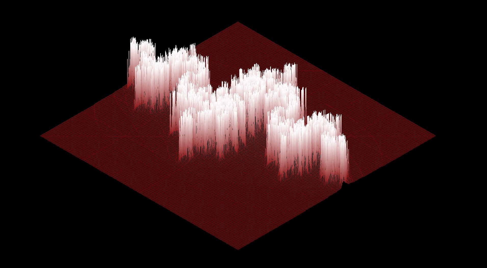
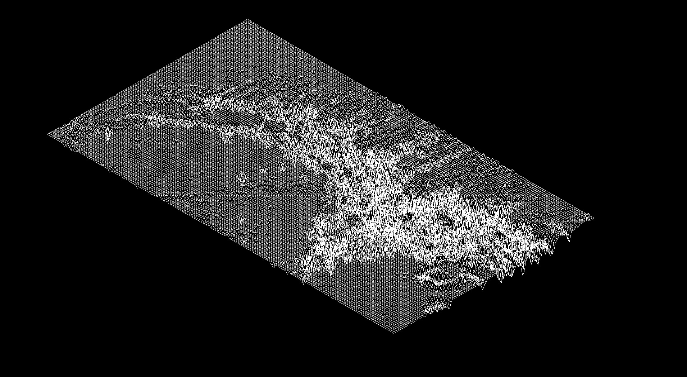
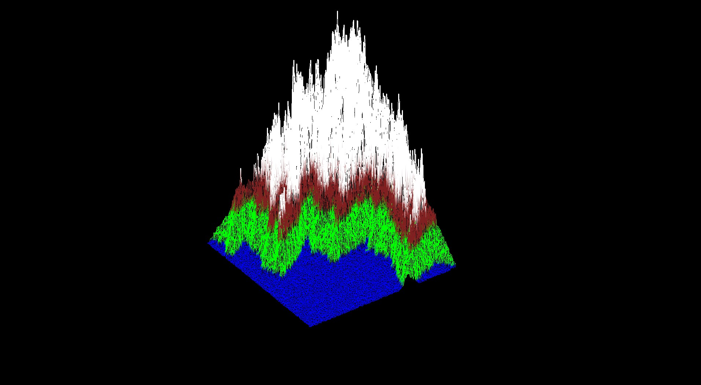

# FdF

This project aims to generate a three-dimensional representation in isometric perspective of a map using a Wireframe Model. For this purpose, I have used the MLX library from 42 school, which allows creating windows from the operating system, drawing pixels on the screen, handling inputs, and generating new frames if we want to update the image.

## Images





## Installation

#### Linux

* Dependencies: ``` xorg ``` ``` libxext-dev ``` ``` zlib1g-dev ```

* Download the repository and open the linux folder.

* Inside the mlx folder, execute ``` ./configure ```

* Inside fdf_linux folder, execute ``` make ``` for the standard version, or ``` make bonus``` for the dynamic version with inputs.

* Execute ``` ./fdf any_map.fdf ```. Use a map from the test_maps folder, or even a custom one that you made yourself or downloaded from the web.

#### MacOS

* Download the repository and open the MacOS folder.

* Inside the mlx folder, execute ``` ./make ```

* Inside fdf_linux folder, execute ``` make ``` for the standard version, or ``` make bonus``` for the dynamic version with inputs.

* Execute ``` ./fdf any_map.fdf ```. Use a map from the test_maps folder, or even a custom one that you made yourself or downloaded from the web.

## Bonus Inputs

* Movement: Mouse click

* Zoom In / Zoom out: Mouse wheel

* Rotation:
    * X Axis: ``` W ``` ``` S ```
    * Y Axis: ``` D ``` ``` A ```
    * Z Axis: ``` Q ``` ``` E ```
* Constant Rotation:
    * X Axis: ``` K ``` ``` I ```
    * Y Axis: ``` L ``` ``` O ```
    * Z Axis: ``` J ``` ``` Z ```

* Change elevation: ``` F ``` ``` C ```
* Change Proyection: ``` P ```
* Reset: ``` R ```
* Exit: ``` Esc ```

## Overview

The program takes as an argument a file with the .fdf extension, which must contain a map with integer numbers. The position of each integer on the map represents a point, and its value corresponds to the elevation or the Z value of the vector. All lines of the map must contain the same number of integers.

The representation is three-dimensional and initially isometric, but it includes options to change the projection type. It handles color (the integer can be accompanied by a hexadecimal number). The image is constantly updated, allowing for the management of certain inputs: you can move with the mouse, zoom in and out, rotate on all three axes, and change the scale factor of the Z value.

## MLX

The MLX library is a graphical library created by students and staff of the 42 school. [This documentation](https://harm-smits.github.io/42docs/libs/minilibx/getting_started.html) is really useful for understanding how it works and is the resource I used throughout the development of the project.

In the implementation section, I will not go into details on how to use the library, as it can sometimes be quite cumbersome. The aforementioned guide is comprehensive and addresses most of the necessary aspects to complete a project like this one.

In my opinion, the most important thing to know about this library for this project is how to display a pixel on the screen, as it is the basis of the entire representation:

* An image is a pointer to a memory address with a specific resolution. Do not confuse the window size with the image size. We can have a window with a resolution of 1920x1080, and inside it one (or several) images of different sizes.

* Each pixel on the screen is composed of 32 bits to represent the color (channels R, G, B, and Alpha/Opacity), with each value occupying one byte. Therefore, if we have an image of, for example, 200x200 pixels, it will occupy 1,280,000 bits, or 40,000 bytes.

* Using the function ```addr = mlx_get_data_addr(img, &bits_per_pixel, &line_length, &endian); ``` , it is possible to obtain several useful values about the image that will allow us to draw a pixel on the screen. The calculation would be. ``` pixel = addr + (y * line_length + x * bits_per_pixel / 8```. reserves a bit more memory per line as a margin, so it is necessary to call the mlx_get_data_addr() function for it to work correctly.

## Implementation

The first step is to open the file containing the map and parse its content. If any character is not an integer or there are more spaces between numbers than expected, the program terminates. However, if everything is verified to be correct, all data is stored in a data structure, in my case, a double matrix of structures, each holding the value of the corresponding vector.

Next, the size of the figure is determined based on the distance between each point. Once the size is known, the desired rotation is applied to the figure by multiplying each point by the rotation matrix with the desired angle. Finally, each vector undergoes a transformation to elevate the figure and convert it into an isometric view.

Once each point is positioned, we connect the points using the [Bresenham's line algorithm](https://en.wikipedia.org/wiki/Bresenham%27s_line_algorithm), a classic algorithm for drawing lines in computer graphics.

n its bonus version, this project incorporates user input. For this purpose, the MLX library provides functions to detect key presses. We can adjust the calculations performed on each vector within an infinite loop responsible for generating images. Whenever the user presses a key, the base values used in the calculations are modified, allowing us to alter the shape of the figure dynamically.
